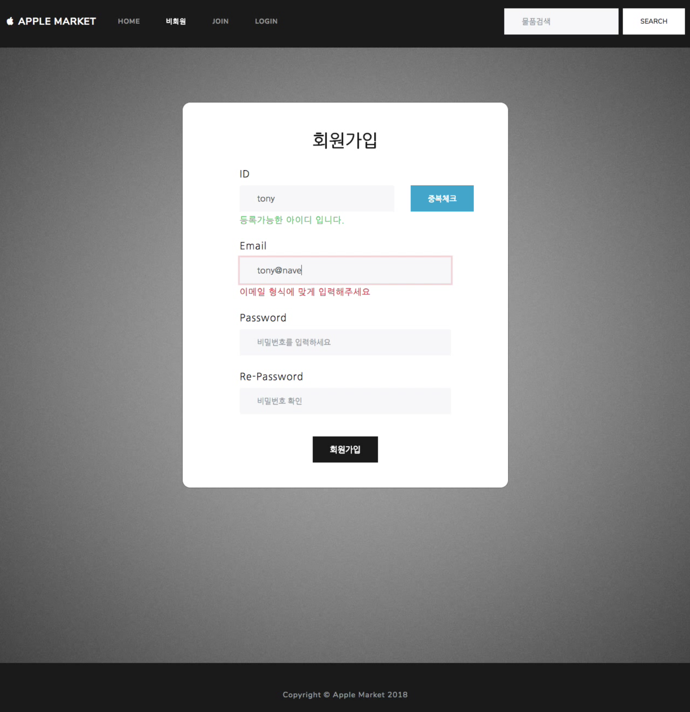
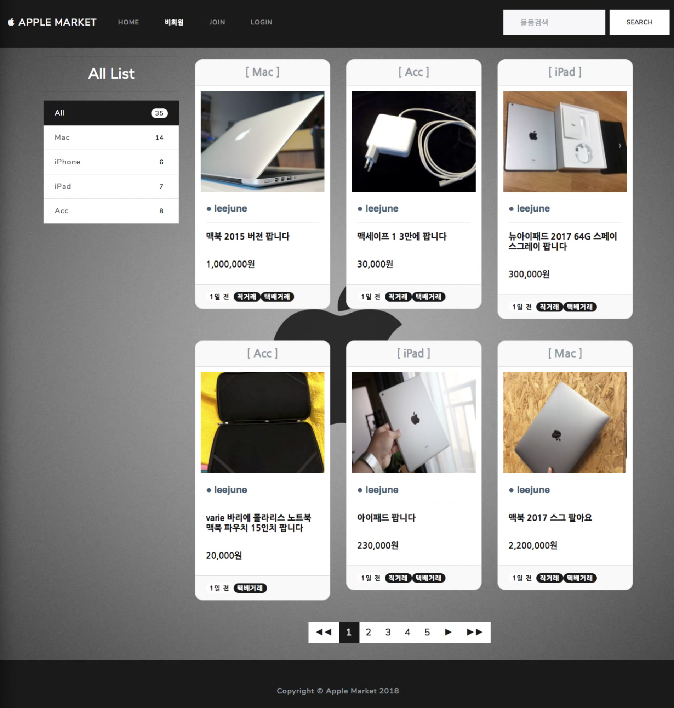
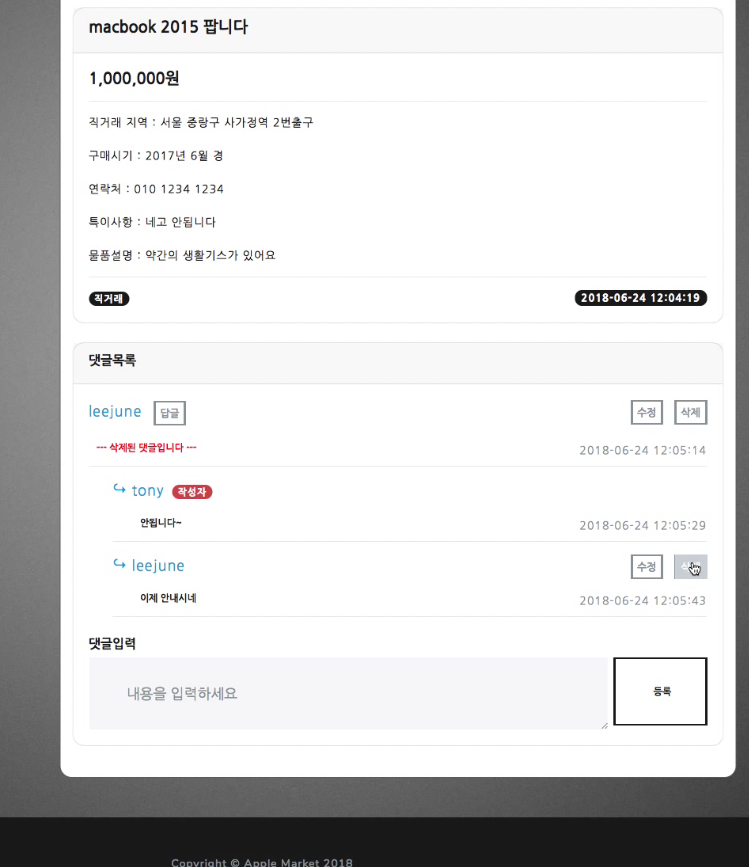
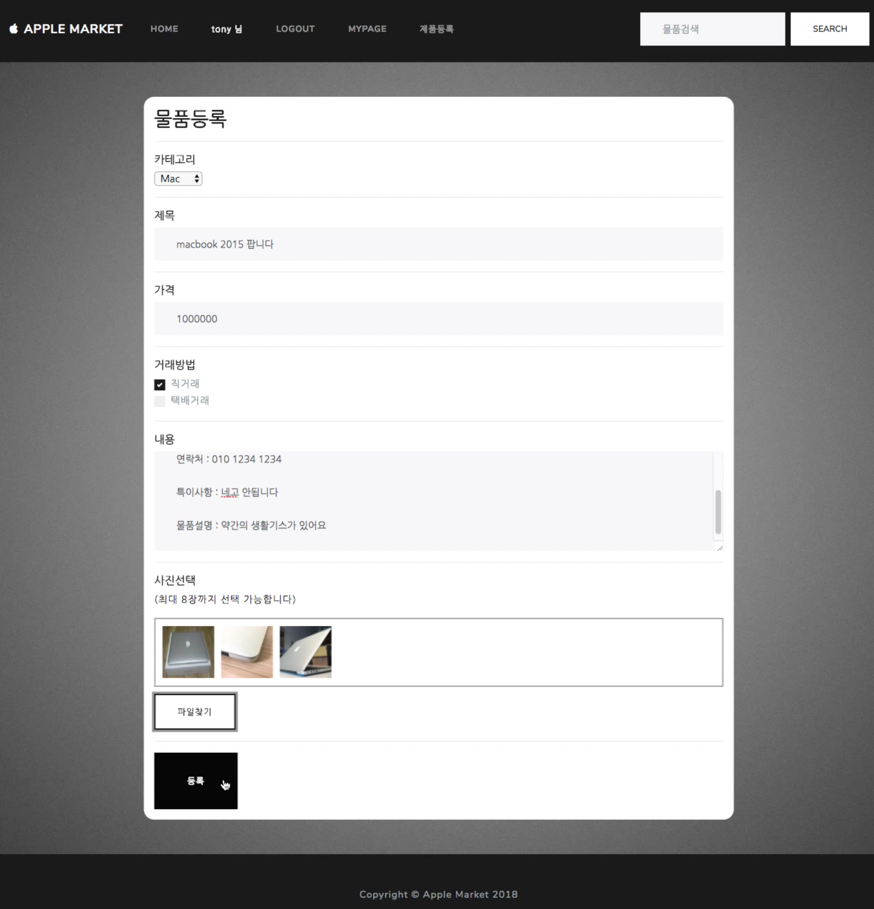
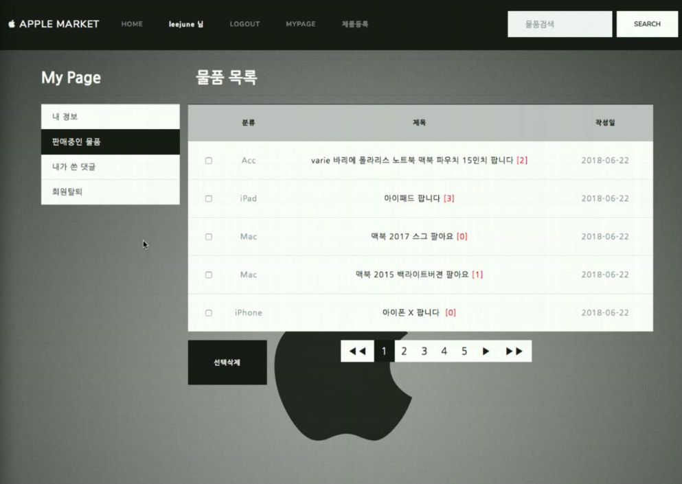

# AppleMarket  ( 2018.05.14 ~ 2018. 06.23 )

**Language**    : PHP, JavaScript, HTML, CSS

**Environment** : MacOs, CentOs 7(Parallels)

**WebServer**   : Apache

**DataBase**    : MySQL

**Position**    : 1인 개발

**Library**     : jQuery, Ajax, Bootstrap
              
**목적** : 애플제품을 중고로 판매할 수 있는 중고거래 사이트입니다.

* * * 
# 1. 회원가입, 로그인
- Ajax를 통해 사용가능한 아이디인지 실시간으로 중복체크가 가능합니다.
- 정규식을 적용해, 해당 양식에 맞아야 가입할 수 있습니다.
- 로그인세션을 사용하여, 사용자 접속이 유지될수 있게 만들었습니다.

* * * 

# 2. 물품리스트
- 한 페이지 당 6개씩 게시물이 나타나게 페이징을 하였습니다.
 
* * * 

# 3. 제품 댓글기능
- Ajax를 사용해 실시간 댓글입력, 수정, 삭제가 가능합니다.
- 대댓글을 달 수 있습니다. 
- 대댓글이 달린 댓글을 삭제할 경우 원본댓글은 --- 삭제된댓글 --- 이라 표시되며
  마지막 대댓글이 삭제될 경우만 댓글이 삭제됩니다.

* * * 

# 4. 제품 등록
- 제품등록, 수정, 삭제 기능을 구현했습니다.
- 다중 이미지를 등록할 수 있습니다.

* * * 

# 5. 마이페이지
- 판매중인 물품, 내가 단 댓글, 회원정보수정, 회원탈퇴를 할 수 있습니다.
 
 * * * 
